# InveShastra

### Screenshot

  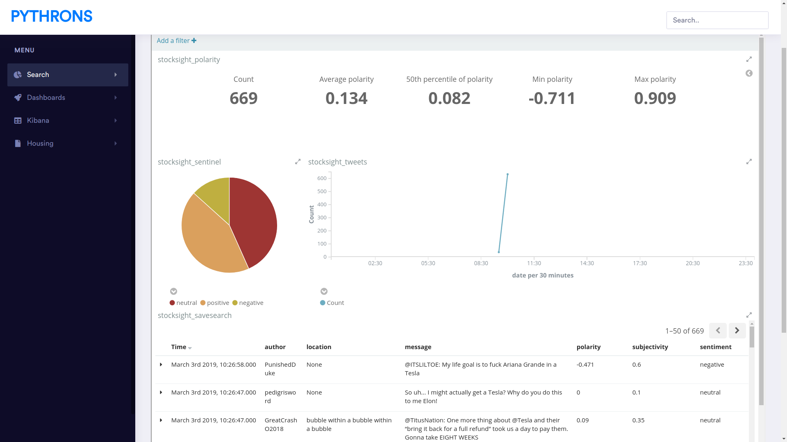
  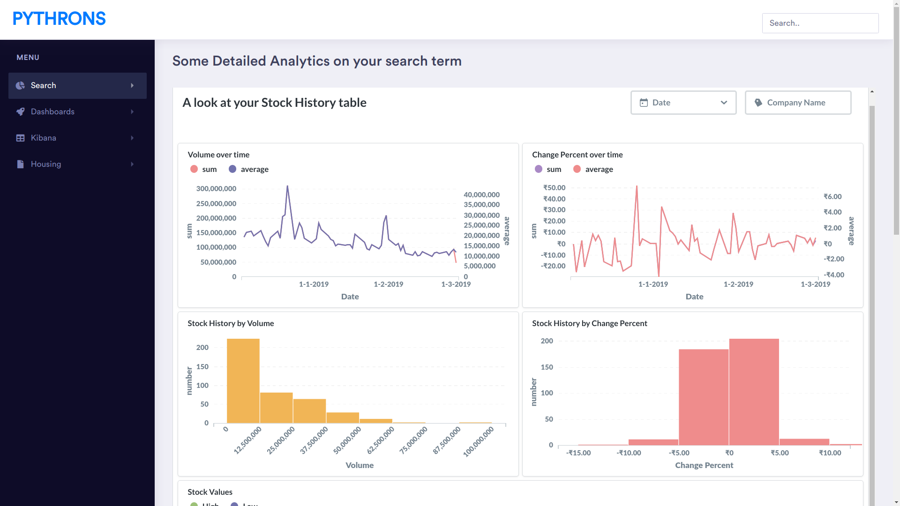
  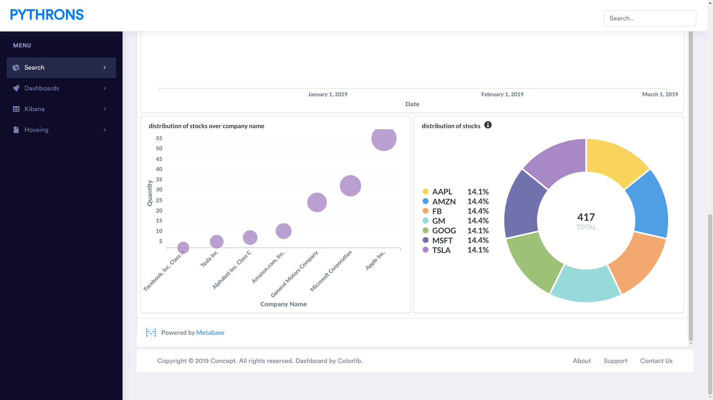
  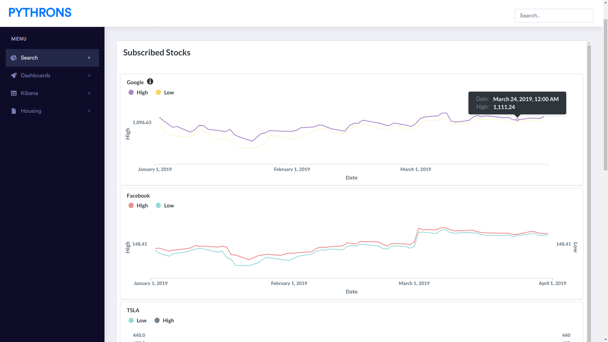
  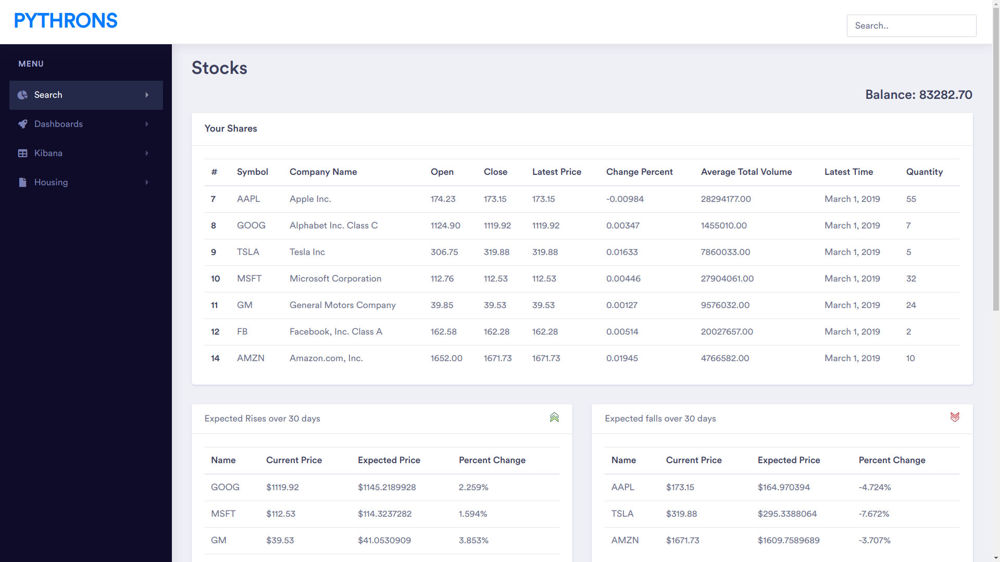
  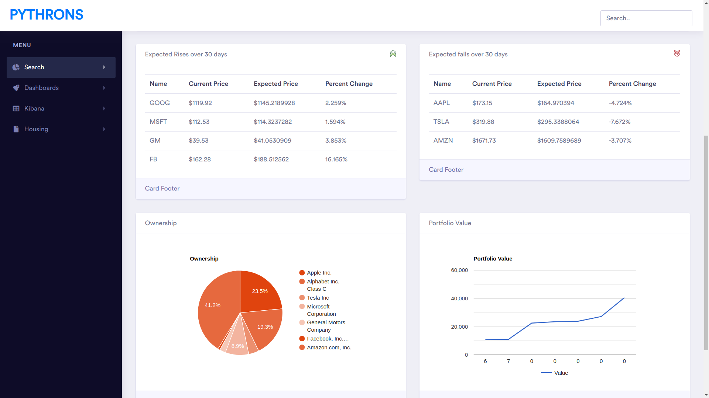
  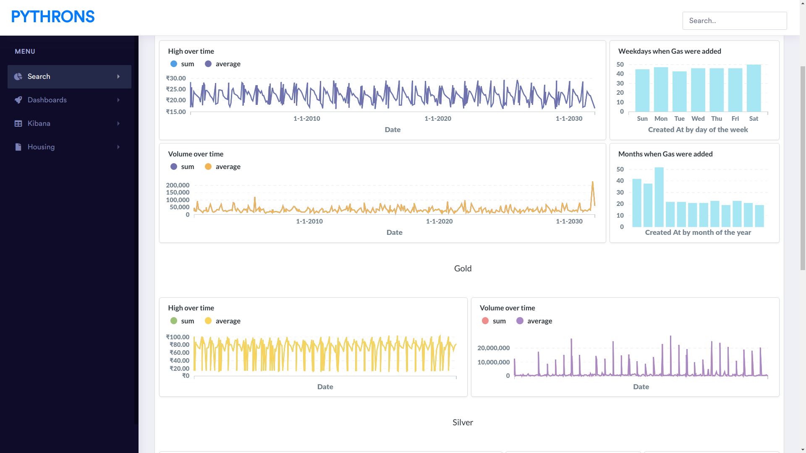
  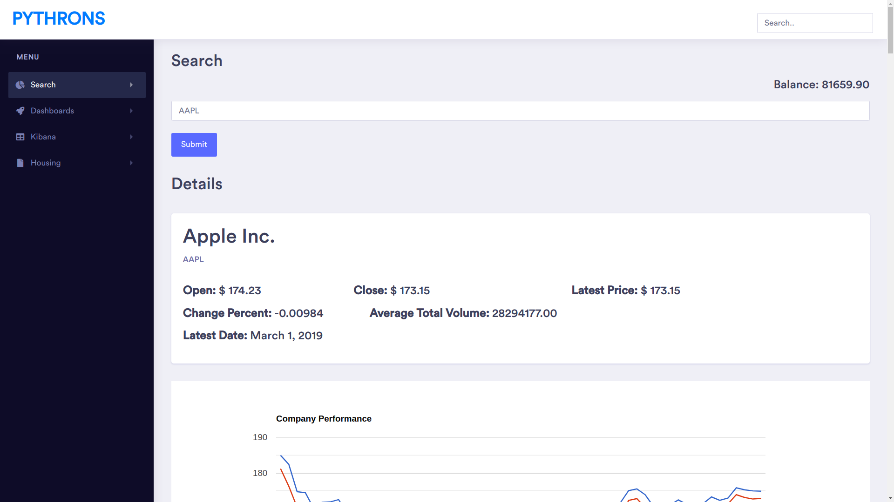
  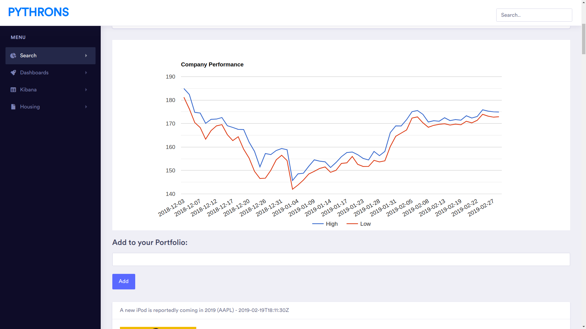
  
<!--    -->
  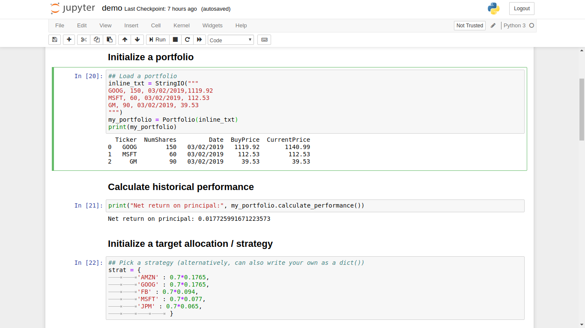
  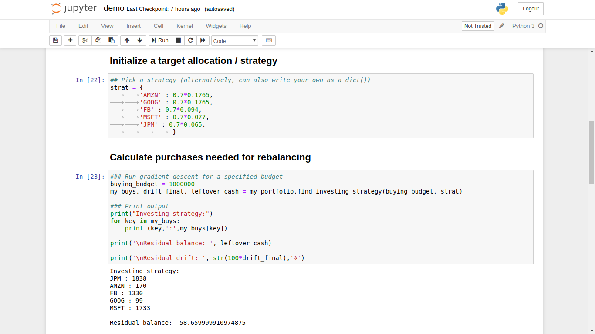
  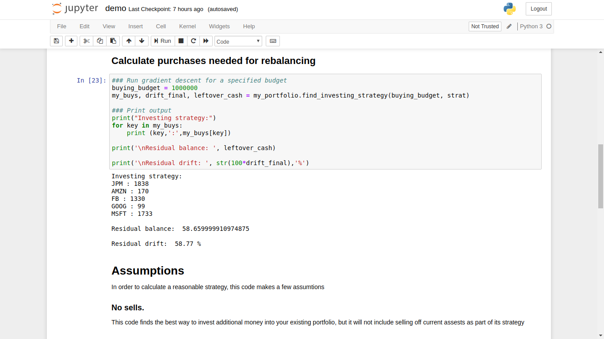
  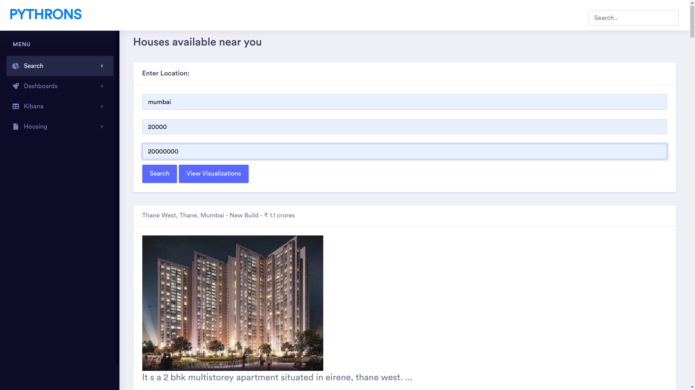
  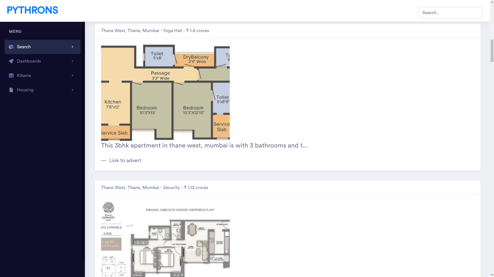

### Installation guide

Step 1 - Download the following

https://www.apachefriends.org/download.html - XAMPP for PHP, MySQL - download this

https://www.metabase.com/start/jar.html - Download this jar file

Install xampp
Execute xampp, mysql
Run metabase jar file. Run this command in the command line (navigate the command line to the folder where you downloaded the jar file) java -jar metabase.jar
Place the repository into C:/xampp/htdocs
Type localhost/politics/index.php in the browser

### Developers
[Milind Shah](https://github.com/mlndshh)
[Keval Nagda](https://github.com/pumpkinman008)
[Pratik Mulchandani](https://github.com/prtk1910)
